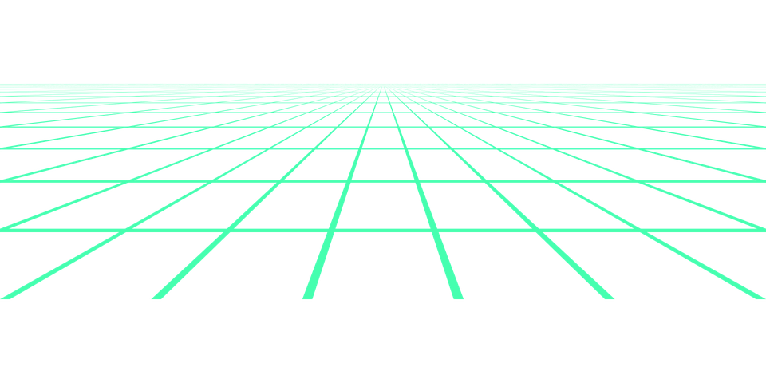

<!-- 
 -->

<!-- 
 -->

<!-- 
 -->

- 🔭 I’m currently working on something cool :wink:
- 🌱 I’m currently learning AWS SAA
- 📫 How to reach me: mohamedanwer006@gmail.com

# **Skill Set**

These are some of the major technologies that I use or have worked on in the past:

## **Programming Languages**

## **Libraries and Frameworks**

## **Cloud**

## **Databases**

 

## **Tools**

  

  

<h4 align="center">Visitor's count :eyes:</h4>

